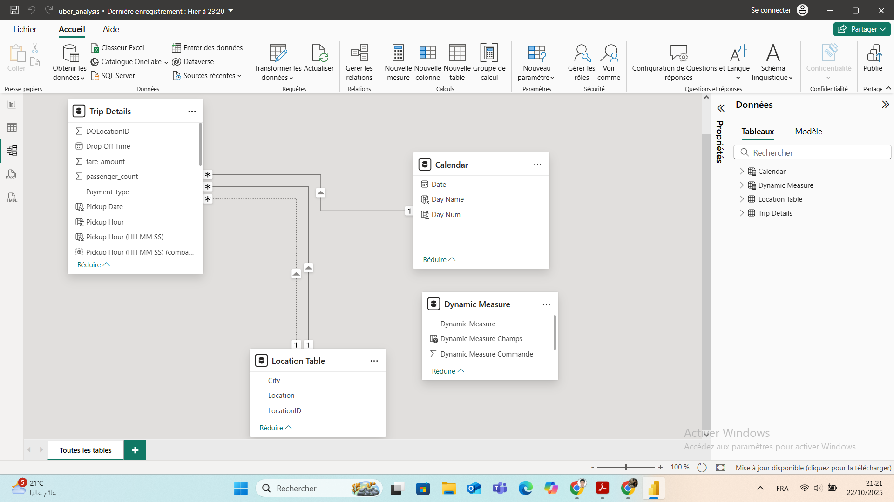

# 📊 Uber Trip Analysis Dashboard – Power BI

> **Data Visualization Project** | *Insightful analysis of Uber trip data to uncover trends, user behavior, and operational opportunities.*

---

## 🎯 Project Overview

This Power BI dashboard provides a comprehensive, interactive view of Uber trip performance. Designed for business and operations stakeholders, it enables data-driven decisions by revealing patterns in trip volume, revenue, vehicle usage, time-of-day demand, and geographic hotspots.

---

## 🧩 Data Model Structure

The report is built on a star-schema data model with four core tables:

1. **`Trip Details`** – Core fact table containing trip-level data (trip ID, pickup/dropoff times, vehicle type, fare, distance, passenger count, etc.).
2. **`Location Table`** – Dimension table with geographic info (city, location name, location ID) for pickup and dropoff points.
3. **`Calendar`** – Auto-generated date dimension for robust time-based analysis (day, week, month, quarter).
4. **`Dynamic Measure`** – Utility table enabling dynamic KPI selection (e.g., “Total Booking Value” vs. “Total Bookings”) via DAX.

---

## 📈 Dashboard: Overview Analysis

A high-level summary of key performance indicators and cross-cutting insights:

- **Core Metrics**: Total trips, total revenue, total distance, average trip duration.
- **Payment Method Breakdown**: Volume and value by payment type (Uber Pay, Cash, Amazon Pay, Google Pay).
- **Day vs. Night Trips**: Performance comparison between daytime and nighttime rides.
- **Vehicle Type Analysis**: Booking volume, revenue, and average distance by vehicle class (UberX, Uber Comfort, Uber Black, UberXL, Uber Green).
- **Geographic Insights**: Top pickup locations and longest recorded trip.

---

## ⏳ Dashboard: Time-Based Analysis

Focused on temporal trends to support resource planning and surge pricing strategies:

- **Trips by Hour of Day**: Line chart showing daily demand peaks.
- **Trips by Day of Week**: Weekly pattern analysis.
- **Hour × Day Heatmap**: Matrix visualization highlighting the busiest hour/day combinations (darker = higher demand).

---

## 📋 Dashboard: Trip Details

Granular view for deep-dive investigations or data validation:

- **Raw Data Table**: Full list of trips with interactive filtering and sorting.
- **Cross-Filtering**: All selections from other pages dynamically filter this table for contextual exploration.

---

## 🔧 Technical Highlights

- **Dynamic DAX Measures**: Flexible KPIs that adapt based on user selections.
- **Full Interactivity**: Click any visual to cross-filter all others in real time.
- **Synchronized Slicers**: Date and city filters apply consistently across all report pages.
- **Clean, Professional Design**: Optimized for clarity and stakeholder readability.

---
## 🚀 Why This Project?

This dashboard showcases my ability to:
- Transform raw data into actionable business insights.
- Design scalable, user-friendly data models.
- Build intuitive, interactive visualizations.
- Communicate complex findings clearly to non-technical audiences.

