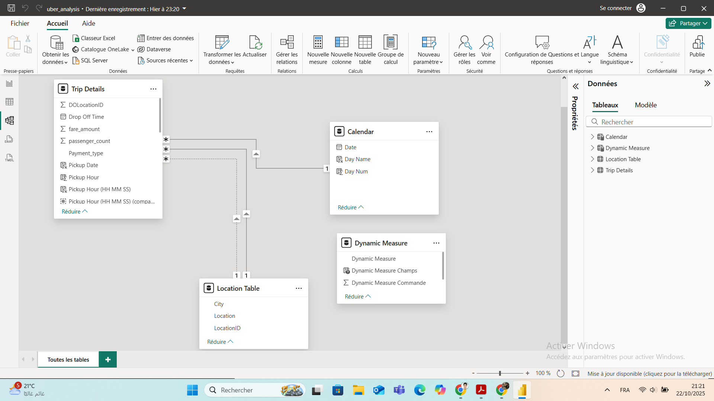
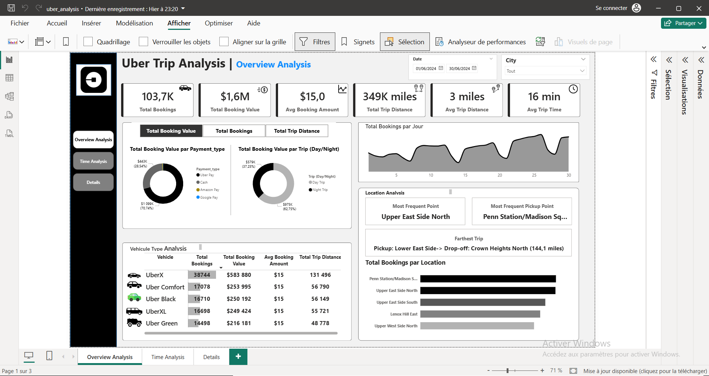
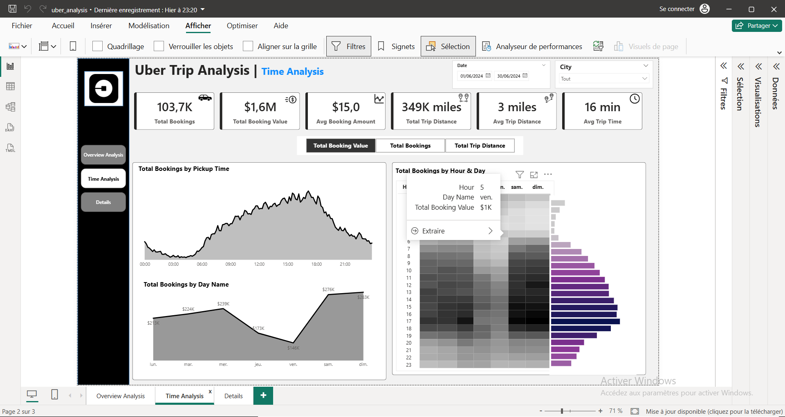
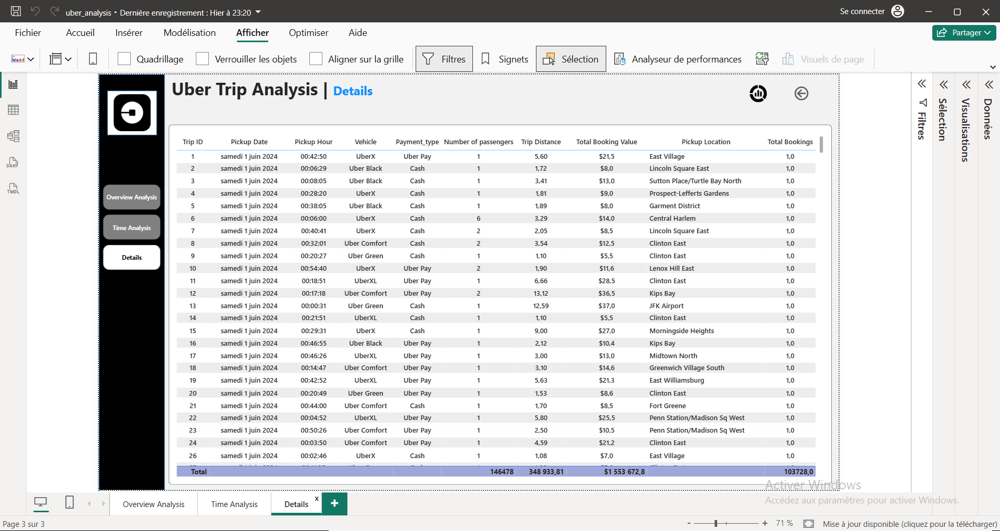

# 📊 Analyse des Trajets Uber avec Power BI

> **Projet de Data Visualisation** | *Analyse approfondie des données de trajets Uber pour identifier des tendances, des comportements clients et des opportunités d'optimisation.*

---

## 🎯 Objectif du Projet

Ce dashboard Power BI a été conçu pour fournir une vue d'ensemble complète et interactive des performances opérationnelles et commerciales des trajets Uber. L'objectif est de permettre aux décideurs de comprendre les tendances temporelles, les préférences des utilisateurs, la répartition géographique et la performance des différents types de véhicules.

---

## 🧩 Structure du Modèle de Données

Le modèle de données repose sur 4 tables principales interconnectées :

1.  **`Trip Details`** : Table principale contenant les détails de chaque trajet (ID, date/heure de prise en charge, type de véhicule, montant, nombre de passagers, etc.).
2.  **`Location Table`** : Contient les informations géographiques (ville, nom du lieu, ID de localisation) pour les points de prise en charge et de dépose.
3.  **`Calendar`** : Table de dimension temporelle générée pour faciliter l'analyse par jour, semaine, mois, etc.
4.  **`Dynamic Measure`** : Table contenant des mesures DAX dynamiques pour créer des indicateurs flexibles (ex: "Total Booking Value", "Total Bookings").

---

## 📈 Dashboard : Vue d'Ensemble (`Overview Analysis`)

Cette page offre une synthèse des KPI clés et des analyses transversales :

-   **KPI Globaux** : Nombre total de réservations, valeur totale des réservations, distance totale parcourue, durée moyenne des trajets.
-   **Répartition par Moyen de Paiement** : Analyse du volume et de la valeur des réservations par méthode de paiement (Uber Pay, Cash, Amazon Pay, Google Pay).
-   **Répartition Jour/Nuit** : Comparaison des performances entre les trajets diurnes et nocturnes.
-   **Analyse des Véhicules** : Performance comparative des différents types de véhicules (UberX, Uber Comfort, Uber Black, UberXL, Uber Green) en termes de nombre de réservations, valeur totale et distance moyenne.
-   **Analyse Géographique** : Identification des points de prise en charge les plus fréquentés et du trajet le plus long enregistré.

---

## ⏳ Dashboard : Analyse Temporelle (`Time Analysis`)

Cette page se concentre sur les tendances temporelles pour optimiser la planification des ressources :

-   **Réservations par Heure de Prise en Charge** : Graphique en courbe montrant les pics d'activité tout au long de la journée.
-   **Réservations par Jour de la Semaine** : Analyse de la demande selon les jours (lundi, mardi...).
-   **Heatmap Heure x Jour** : Visualisation matricielle qui met en évidence les combinaisons heure/jour les plus actives (zones sombres = forte demande).

---

## 📋 Dashboard : Détails des Trajets (`Details`)

Page dédiée à l'exploration granulaire des données pour un audit ou une investigation ponctuelle :

-   **Tableau Détailé** : Affiche toutes les lignes de données brutes des trajets, permettant un filtrage et un tri interactifs.
-   **Filtres Dynamiques** : Les filtres appliqués sur les autres pages sont synchronisés ici, permettant de voir les détails correspondants à une sélection spécifique.

---

## 🔧 Fonctionnalités Techniques

-   **Mesures DAX Dynamiques** : Utilisation de mesures complexes pour calculer des agrégations conditionnelles et des comparaisons contextuelles.
-   **Interactivité** : Tous les graphiques et tableaux sont liés entre eux. Un clic sur un élément filtre automatiquement les autres visualisations.
-   **Synchronisation des Filtres** : Les filtres de date et de ville sont appliqués sur l'ensemble des pages du rapport.
-   **Design Responsive** : Le dashboard est conçu pour être lisible sur différents formats d'écran.

---
## 🚀 Pourquoi ce projet ?

Ce projet démontre ma capacité à :
-   Transformer des données brutes en insights actionnables.
-   Construire un modèle de données relationnel robuste.
-   Créer des visualisations intuitives et interactives.
-   Communiquer efficacement des résultats complexes à des parties prenantes non techniques.

